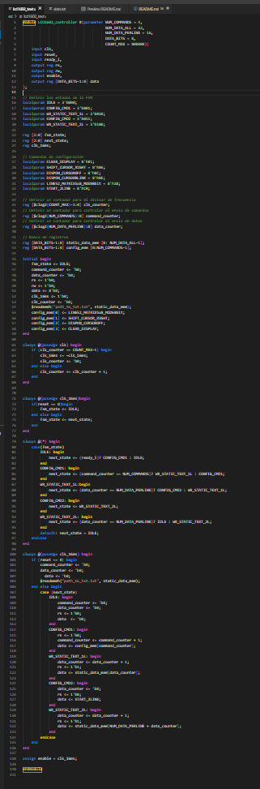

<h1>Lab04 - Visualización usando pantalla LCD 16x2</h1>

<h1>Integrantes</h1>
<ol>
<li>Óscar Moreno</li>
<li>Ángel Jiménez</li>
<li>Jonathan Godoy</li>

<h1>Informe</h1>

Indice:

1. [Diseño implementado](#diseño-implementado)
2. [Simulaciones](#simulaciones)
3. [Implementación](#implementación)
4. [Conclusiones](#conclusiones)
5. [Referencias](#referencias)

<h2>Diseño implementado</h2>
<h3>Descripción</h3>

Una pantalla LCD (Liquid Crystal Display) es un dispositivo digital en el que se puede generar la visualización de varios caracteres de naturaleza alfanumérica. Es decir, es posible visualizar los números esde el 0 hasta el 9, y de las letras desde la A hasta la Z. La pantalla utilizada cuenta con un tamaño denominado 16x2, es decir, son 16 columnas por 2 filas. Ésta también cuenta con 16 espacios para la correcta soldadura a terminales machos, para la correcta conexión a la tarjeta reprogramable Cyclone IV. Esta panatalla puede operar entre 4 y 8 bits.

Lo que se buscaba en la práctica de la implementación, era la visualización de un par de mensajes, traducidos en lenguaje ASCII (American Standard Code for Information Interchange), el cual es un lenguaje de codificación de caracteres mediante la representación de valores numéricos en formato binario.

<h3>Diagramas</h3>

Se presentará a continuación en código del módulo proporcionado por la docente:

El funcionamiento de este módulo permite que, con la pantalla LCD conectada a los pines de propósito general de la Cyclone IV, se pueda consignar los datos presentados, traducir, decodificar, enviar los datos, y representarloss en la pantalla LCD

<h2>Simulaciones</h2> 

No se utilizaron simulaciones en programas afines. Debido a que el proyecto final del grupo estaba direccionado hacia la implementación de la pantalla LCD para la visualización de carcateres numéricos, la parte de la simulación fue reemplazada por todas las anteriores implementaciones hechas para el afianzamiento del proyecto final.
<h2>Implementación</h2>

En la implementación de los diferentes mensajes en la pantalla LCD, inicialmente, y gracias al módulo proporcionado, el mensaje que se buscaba implmentar era "Bateria 1 Bateria 2", en el que cada palabra con cada número compartiera una línea de la pantalla. Este mensaje estaba consignado de manera aparte en un archivo adjunto .txt, el cual consignaba este mensaje en lenguaje ASCII.
 

Partiendo de aquí, y buscando representar otro mensaje en la pantalla LCD, por medio de una página web en traducción de lenguaje textual a lenguaje ASCII, se decidió colocar un segundo mensaje

Este segundo mensaje, de manera textual dictaba "<b><i>Profe, pónganos 5.0, todo bien</i></b>", el cual cuenta con letras mayúsculas, signos de puntuación, números, y caracteres especiales que cuentan con el acento característico del idioma español, que es la tilde. La traducción a lenguaje ASCII es la siguiente:

<b>50 72 6F 66 65 2C 20 70 F3 6E 67 61 6E 6F 73 20 35 2E 30 20 74 6F 64 6F 20 62 69 65 6E 0A</b>

La traducción ASCII utilizada es de tipo hexadecimal, que es la notación precisa para la coreecta traducción e implementación en la pantalla LCD.

<h2>Conclusiones</h2>

Para concluir se presenta que:

<ol>
<li>La aplicación de la representación de datos en una pantalla LCD es posible gracias a protocolos de comunicación y a una aplicación de una Máquina de Estados Finitos</li>
<li>El uso de una pantalla LCD permite una mejor implementación en la fabricación de proyectos finales con orientación en educación</li>
<h2>Referencias</h2>

